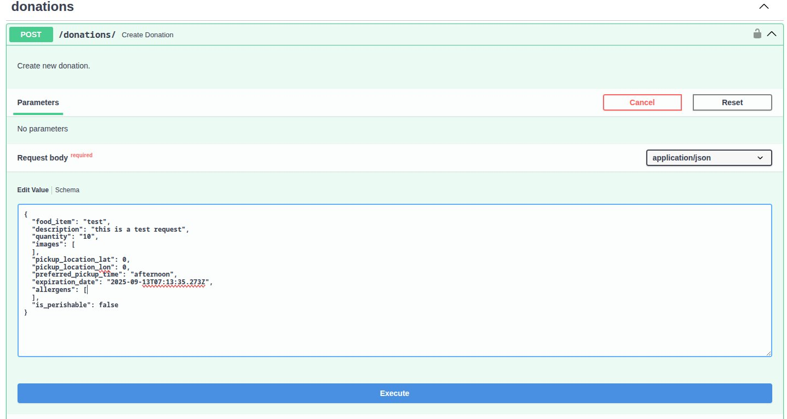
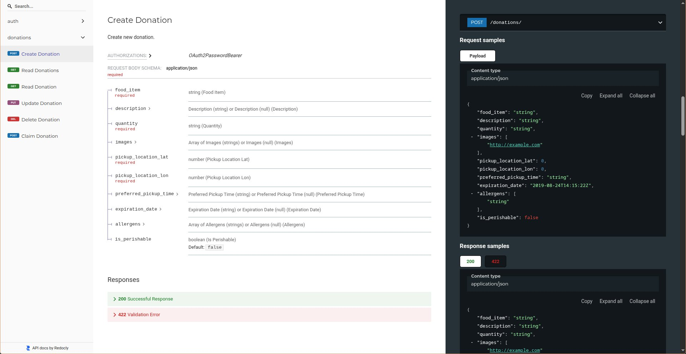

# ShearBite

<div align="center">
  
</div>

<p align="center">
  <strong>A full-stack application for food donation and browsing.</strong>
</p>

<p align="center">
  
  
  
  
  
  
  
</p>

ShearBite is a full-stack application that allows users to donate and browse food items. It is built with a modern architecture using FastAPI for the backend, Next.js for the frontend, and Docker for containerization.

## Architecture

The application is designed with a microservices-based architecture, containerized using Docker and managed with Docker Compose.

```
+-----------------+      +-----------------+      +-----------------+
|     Traefik     |----->|     Frontend    |----->|     Backend     |
| (Reverse Proxy) |      | (Next.js)       |      | (FastAPI)       |
+-----------------+      +-----------------+      +-----------------+
                                                     |
                                                     |
                                                     v
                                             +-----------------+
                                             |   PostgreSQL    |
                                             |   (Database)    |
                                             +-----------------+
                                                     |
                                                     |
                                                     v
                                             +-----------------+
                                             |      MinIO      |
                                             | (Object Storage)|
                                             +-----------------+
```

- **Traefik:** Acts as a reverse proxy, routing traffic to the appropriate service based on the hostname.
- **Frontend:** A Next.js application that provides the user interface.
- **Backend:** A FastAPI application that provides the API for the frontend.
- **PostgreSQL:** The main database for storing application data.
- **MinIO:** An object storage service for storing images and other files.

## Project Structure

```
.
├── backend
│   ├── alembic
│   ├── app
│   ├── tests
│   ├── alembic.ini
│   ├── Dockerfile
│   ├── pyproject.toml
│   └── requirements.txt
├── frontend
│   ├── components
│   ├── contexts
│   ├── pages
│   ├── public
│   ├── styles
│   ├── Dockerfile
│   ├── next.config.ts
│   ├── package.json
│   └── tsconfig.json
├── docs
│   ├── screenshots
│   └── api.md
├── docker-compose.yaml
└── README.md
```

## Technologies

### Backend
- [Python 3.12](https://www.python.org/)
- [FastAPI](https://fastapi.tiangolo.com/)
- [PostgreSQL](https://www.postgresql.org/)
- [Alembic](https://alembic.sqlalchemy.org/en/latest/) for database migrations
- [SQLAlchemy](https://www.sqlalchemy.org/) for ORM
- [MinIO](https://min.io/) for object storage

### Frontend
- [Next.js](https://nextjs.org/)
- [React](https://reactjs.org/)
- [TypeScript](https://www.typescriptlang.org/)
- [Tailwind CSS](https://tailwindcss.com/)

### Development
- [Docker](https://www.docker.com/)
- [Docker Compose](https://docs.docker.com/compose/)

## Getting Started

### Prerequisites

- [Docker](https://docs.docker.com/get-docker/)
- [Docker Compose](https://docs.docker.com/compose/install/)

### Installation

1. **Clone the repository:**
   ```bash
   git clone https://github.com/AliceCressence/ShareBite.git
   ```

2. **Navigate to the project directory:**
   ```bash
   cd shearbite
   ```

3. **Start the application:**
   ```bash
   docker-compose up -d
   ```

4. **Create the database tables:**
   ```bash
   docker-compose exec backend alembic upgrade head
   ```

The application will be available at the following URLs:

- **Frontend:** [http://localhost](http://localhost)
- **Backend API:** [http://api.localhost](http://api.localhost)
- **MinIO Console:** [http://minio-console.localhost](http://minio-console.localhost)

## Features

- User registration and authentication
- Create, read, update, and delete donations
- Browse and search for donations
- Image uploads for donations

## Screenshots

### Create Donation


### API Documentation


## API Documentation

The API documentation is available in the [docs/api.md](docs/api.md) file.

For a more interactive experience, the backend API documentation is automatically generated by FastAPI and is available at the following endpoints:

- **Swagger UI:** [http://api.localhost/docs](http://api.localhost/docs)
- **ReDoc:** [http://api.localhost/redoc](http://api.localhost/redoc)

## Contributing

Contributions are welcome! Please see the [Contributing Guidelines](CONTRIBUTING.md) for more details.

## License

This project is licensed under the MIT License. See the [LICENSE](LICENSE) file for details.

## Code of Conduct

Please note that this project is released with a [Contributor Code of Conduct](CODE_OF_CONDUCT.md). By participating in this project you agree to abide by its terms.
